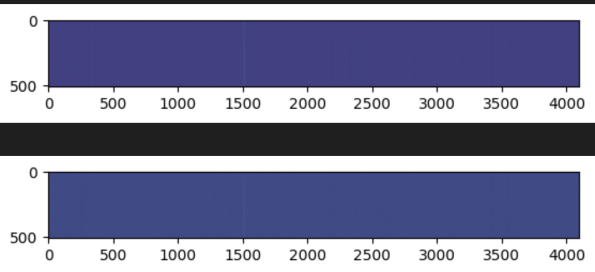

By saving the activations on just 400 samples from Llama 7B, a hyena operator can be trained which can be swapped in with a minimal drop in perplexity.

The minimally trained small Hyena op increases perplexity from 1.55 to 1.58. For comparison, replacing the attention output with a matrix of ones increases perplexity to 10.11, and skipping the attention layer increases perplexity to 1.78
